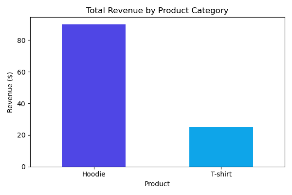
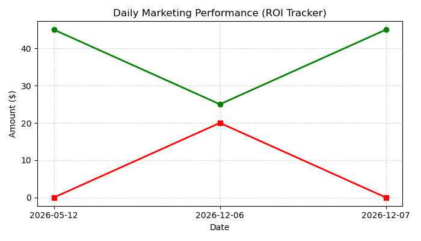

# Automated E-Commerce Data cleaning & ROI Analytic Pipeline
## The problem
A small e-commerce retailer losing hours manually copying data across Shopify, PayPal, and Facebook Ads. The data suffered from duplicates rows, missing tracking links ('NaN'), and inconsistent date formatting.

## The solution
I built a single-click Python script using `pandas` and `matplotlib` that:
1. **Cleans & Standardizes Data:** Parses mixed dates, strips currency characters, handles whitespaces, and converts data types.
2. **De-duplicate & Imputes:** Purges system glitches, drops unlinked records,  and fills broken marketing links with safe defaults.
3. **Automates Reports:** Generates automated business analytics charts instantly.

## Results
- Extracted clean master database: `clean_master_report.csv`
- Eliminates 5+ hours of weekly manual reporting tasks.

### Analytics Visualization Generated:

